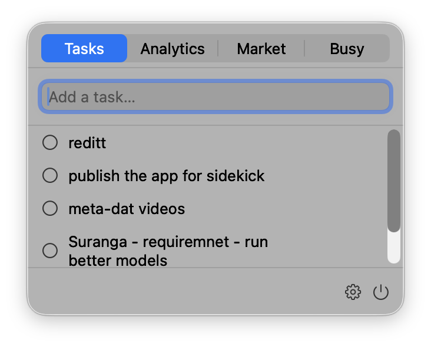
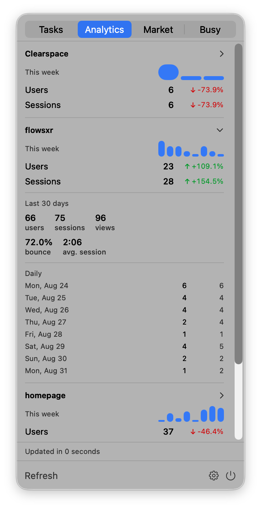
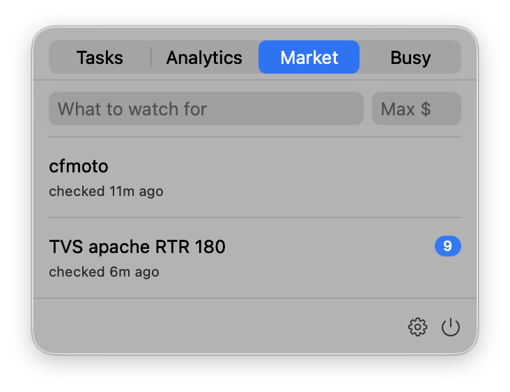
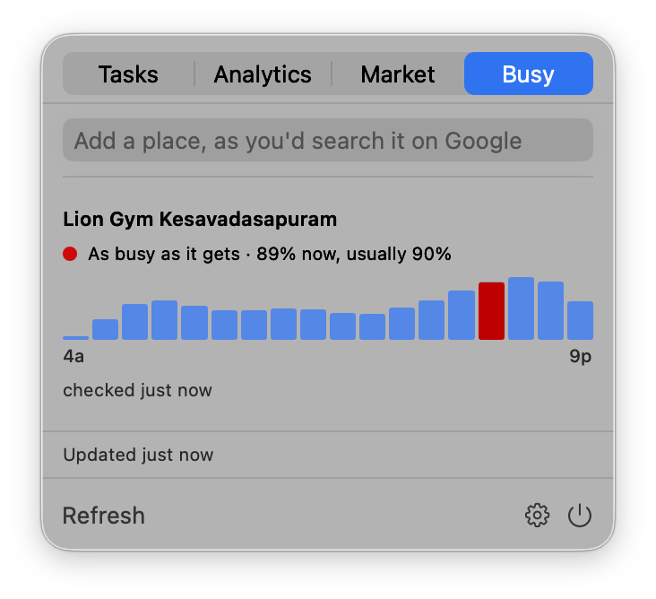
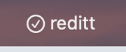

# Perch

Small tools that live in your macOS menu bar.

Perch is a host. The tools themselves are plugins: today there's **Tasks**, a
todo list with the current task in the menu bar; **Analytics**, which puts your Google Analytics
numbers a click away; **Market**, which watches Facebook Marketplace searches;
and **Busy**, which shows how busy a place is right now. More can be added
without disturbing what's already there.

<table>
  <tr>
    <td align="center"><br><sub><b>Tasks</b></sub></td>
    <td align="center"><br><sub><b>Analytics</b></sub></td>
  </tr>
  <tr>
    <td align="center"><br><sub><b>Market</b></sub></td>
    <td align="center"><br><sub><b>Busy</b></sub></td>
  </tr>
</table>

Whichever plugin you make primary owns the menu bar item — here Tasks, showing
the current task:



## Download

Grab the latest `Perch.zip` from the [Releases page](../../releases/latest),
unzip it, and drag `Perch.app` into your Applications folder.

Requires macOS 14 (Sonoma) or later. Apple Silicon and Intel are both supported.

### First launch

This build is signed ad hoc rather than with a paid Apple Developer certificate,
so macOS Gatekeeper will block it the first time. To open it:

1. Right click (or Control click) `Perch.app` and choose **Open**.
2. Click **Open** again in the dialog that appears.

You only need to do this once. If macOS still refuses, run this in Terminal and
try again:

```bash
xattr -dr com.apple.quarantine /Applications/Perch.app
```

## Plugins

### Tasks

- **Current task in the menu bar.** The first unfinished task is always visible.
  Complete it and the next one takes its place.
- **Quick add.** Open the panel, type, press Return.
- **Edit in place.** Double-click a task to fix its title. Return saves, Escape
  cancels.
- **Reorder by dragging.** Whatever you drag to the top becomes your current task.
- **Done section.** Completed tasks collapse out of the way instead of
  disappearing. Clear them when you want.

Tasks declares no capabilities: everything it stores stays on your Mac.

### Analytics

Your GA4 numbers in the menu bar, without opening a browser or running a
script.

- **Latest day in the menu bar.** Active users for whichever property you mark
  primary, read from the most recent day GA has — the property's own timezone,
  not your laptop's.
- **A card per property.** This week versus last with signed percentages, a
  sparkline of the week, and the 30-day totals and daily rows one click down.
- **Half-hourly, and on open.** Refreshes in the background, and again when you
  open the panel if what's cached has gone stale. Last-fetched numbers are kept
  on disk, so the panel opens on real data rather than a spinner.

Analytics declares `network` and `credentials`: it talks to Google, and it
holds a service-account key. It is the first plugin in Perch to do either.

### Busy

How busy a place is right now — Google's live busyness, in the menu bar. Made
for picking a gym time.

- **Add a place the way you'd search for it.** Type "lion gym kesavadasapuram"
  into the panel; Perch shows the name Google matched.
- **Live and usual, side by side.** A coloured dot, Google's own words ("A
  little busy"), the live figure, and what's usual for this hour — so you can
  see busier-than-usual at a glance.
- **Today's shape.** The popular-times histogram for the day, with the current
  hour highlighted. The first place's live figure can sit in the menu bar.
- **Every ten minutes, and on open.** Refreshes in the background, again when
  you open the panel if the numbers have gone stale, and keeps the last
  numbers on disk.

Busy declares `network`. There is no official API for live busyness, so it
loads the Google search page for each place in a hidden browser and reads the
Popular times box — the same thing you'd see in a browser. It never signs in
to anything. Google changes its page from time to time; when that breaks the
reader, the panel says so rather than showing nothing.

#### Setting it up

1. In the [Google Cloud console](https://console.cloud.google.com), create a
   service account and download a JSON key. Enable the **Google Analytics Data
   API**, and the **Admin API** too if you want Perch to find your properties
   for you.
2. In GA4 Admin › Property Access, add the service account's address
   (`…@….iam.gserviceaccount.com`) as a **Viewer**.
3. In Perch, open Settings › Analytics, choose the key file, then either
   **Discover Properties** or add a property by its numeric ID.

Discovery uses whatever name the property carries in GA, which is often the
nickname someone typed into the console years ago rather than the domain. The
name is editable in Settings; renaming is local and nothing is written back to
Google.

The **?** button beside Credentials in Settings has these steps with links,
for when you need them and this file isn't open.

#### If you lose the key

Don't back the key file up — make a new one. Google hands a service-account
key over exactly once, so a copy in cloud storage is a credential sitting
somewhere else you have to defend, in exchange for saving the two minutes
below. Everything that took setting up survives the machine anyway: the
service account, its access to your properties, and the enabled APIs all live
in Google.

1. Cloud console › IAM & Admin › Service Accounts › your account › **Keys** ›
   Add Key › Create new key › JSON.
2. On the same screen, **delete the old key**. If the machine is gone, you
   wanted that key dead regardless.
3. Import the new file in Settings › Analytics.

If you do want a copy, put it in a password manager rather than a file — and
never in a folder that might one day become a git repository.

The key goes into your login Keychain. Perch reads the file you pick once and
never copies it or keeps a reference to it.

## Settings

Click the gear icon in the panel.

| Pane | What's in it |
|---|---|
| General | Which plugin owns the menu bar, title display and length, launch at login, global hotkey |
| Plugins | Enable or disable each plugin, and see what each one can access |
| Tasks | Per-plugin settings, when a plugin has any |
| Analytics | Service-account key, watched properties, which one is primary |
| Market | City, search radius, how often to check |
| Busy | How often to check |

## Your data

Each plugin gets its own directory inside Perch's sandbox container, on your Mac
only:

```
~/Library/Containers/org.ahlab.Perch/Data/Library/Application Support/Perch/Plugins/<plugin-id>/
```

Tasks stores a plain JSON file there and nothing else. If that file is ever
unreadable, Perch keeps a `.bak` copy beside it and tells you, rather than
silently starting empty.

Analytics is the exception, and it is the honest illustration of the limit
here: macOS grants permissions to an app, not to individual plugins. Because
Analytics needs the network, the whole binary carries the network entitlement,
including the plugins that would never use it. Perch's Settings window
discloses what each plugin does, but disclosure is all it can offer — it cannot
sandbox one plugin away from another's permissions. Analytics sends nothing but
authenticated requests to Google's own APIs, and stores its key in the
Keychain rather than in the container.

## Building from source

Perch is a SwiftUI app built around `MenuBarExtra`. The Xcode project is
generated with [XcodeGen](https://github.com/yonaskolb/XcodeGen), so only
`project.yml` is tracked in git.

```bash
brew install xcodegen
git clone https://github.com/prasanthsasikumar/perch.git
cd perch
xcodegen generate
open Perch.xcodeproj
```

Run the tests with:

```bash
xcodebuild test -project Perch.xcodeproj -scheme Perch -destination 'platform=macOS'
```

### Layout

```
PerchKit/                The public plugin API. Knows nothing about the host.
Plugins/MenuDoPlugin/    The Tasks plugin (its original name): model, store, views
Plugins/AnalyticsPlugin/ The Analytics plugin: GA4 client, auth, store, views
Plugins/MarketPlugin/    The Market plugin: Marketplace scraping, poller, store, views
Plugins/BusyPlugin/      The Busy plugin: Google popular-times scraping, store, views
Perch/
  PerchApp.swift         MenuBarExtra scene, plugin instantiation
  Host/                  Registry, panel chrome, menu bar label
  Views/                 Settings window
  Support/               Launch at login, hotkey state, title truncation
PerchTests/              Unit tests for the kit, the plugin, and the host
```

Dependencies are
[KeyboardShortcuts](https://github.com/sindresorhus/KeyboardShortcuts) for the
sandbox-safe global hotkey and
[MenuBarExtraAccess](https://github.com/orchetect/MenuBarExtraAccess) for opening
the panel programmatically.

## Writing a plugin

`PerchKit` is the contract. A plugin is a Swift package depending on it, with one
type conforming to `PerchPlugin`, added to the array in `PerchApp.makePlugins()`.

The API is **0.x and unstable** — it will change once a second plugin proves the
shape is right. Plugins are compiled in rather than loaded at runtime.

## License

MIT. See [LICENSE](LICENSE).
